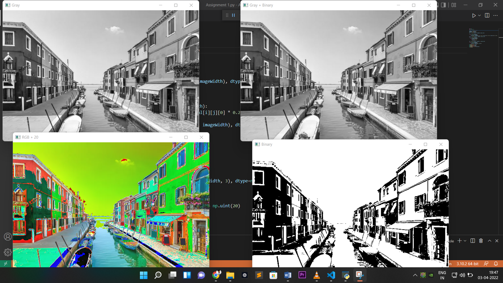

Task1-->Read a color image and convert it into gray scale image without using inbulit function.  
Task2-->Convert the pixel of gray scale image to either 1 or 0.  
Task3-->Add gray image and image with pixels either 1 or 0 and add 20 to gray scale image.  
Performe the task and display the output images.  

**Input Image:   

**Output Image: 
