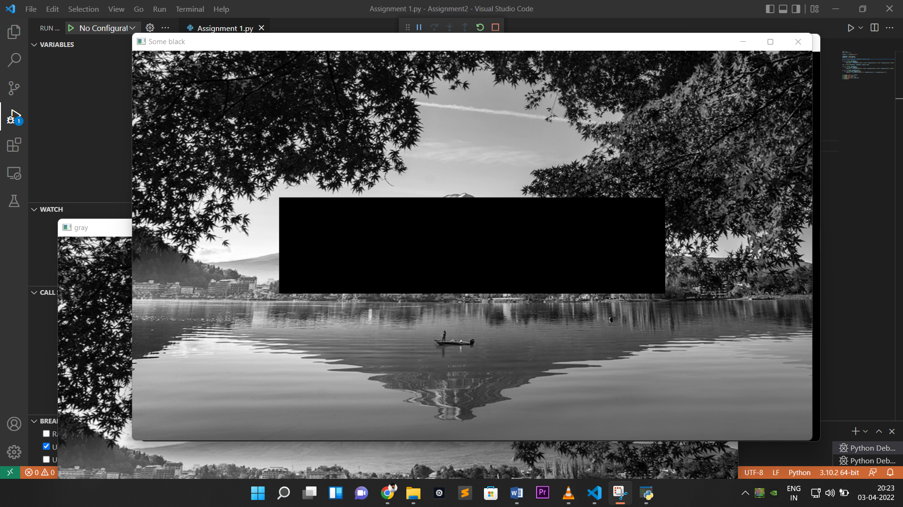

Task-->Read a color image, convert the color image to gray scale and dispaly both images.  
Make some part of that gray scale image total black and display it.   
Now subtract this to images and display output image.  
 

**Input Image :**

 
**Output Gray Image :**

 
**Output Some part of gray Image :**

 
**Output substraction of Some part of gray Image and gray Image  :**

