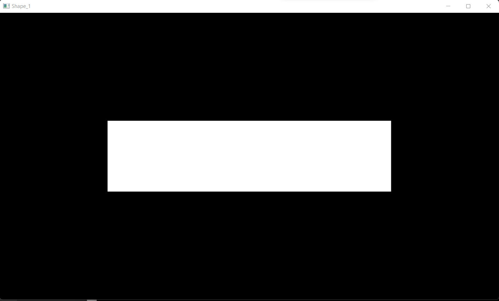
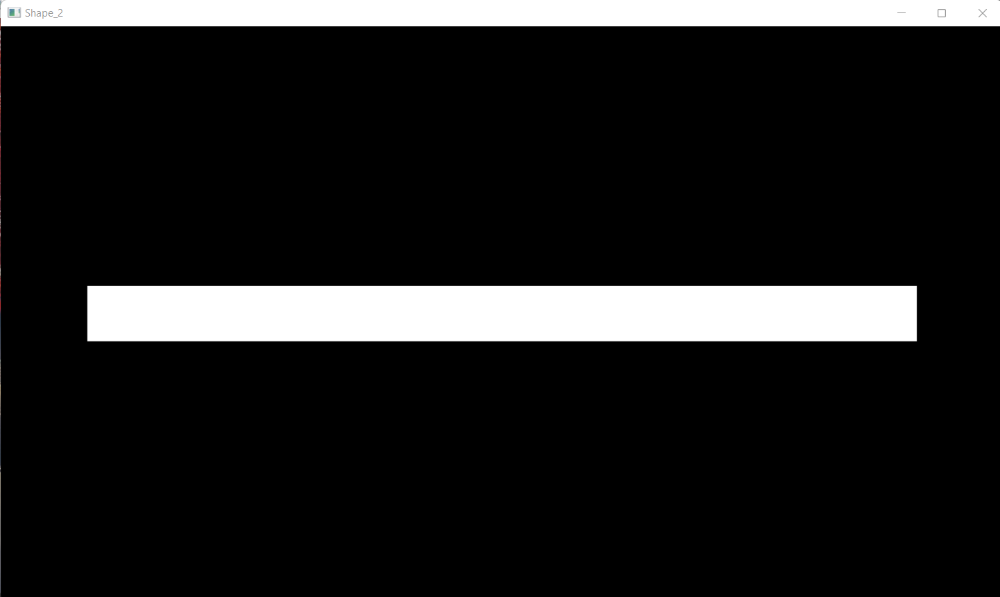
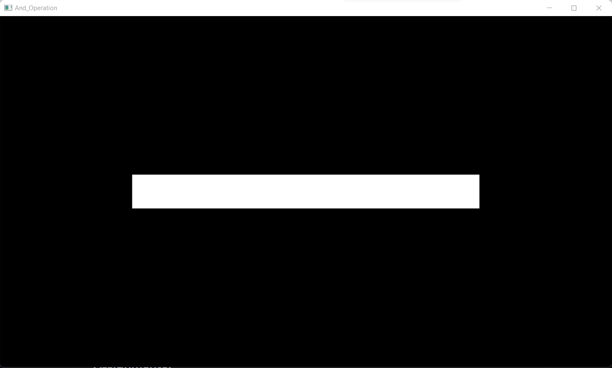
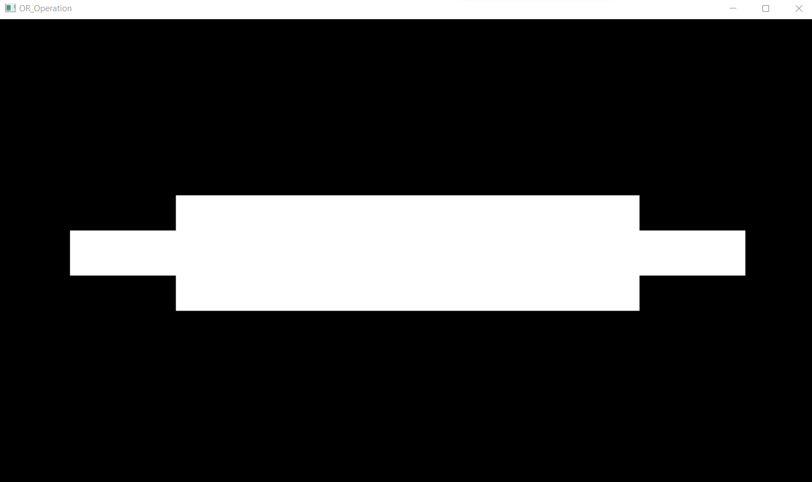
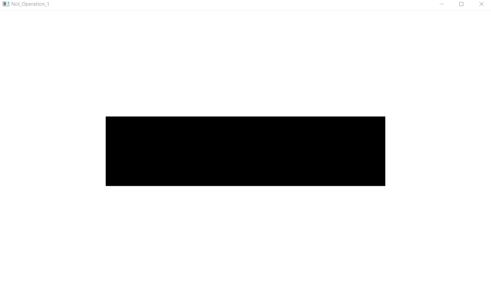
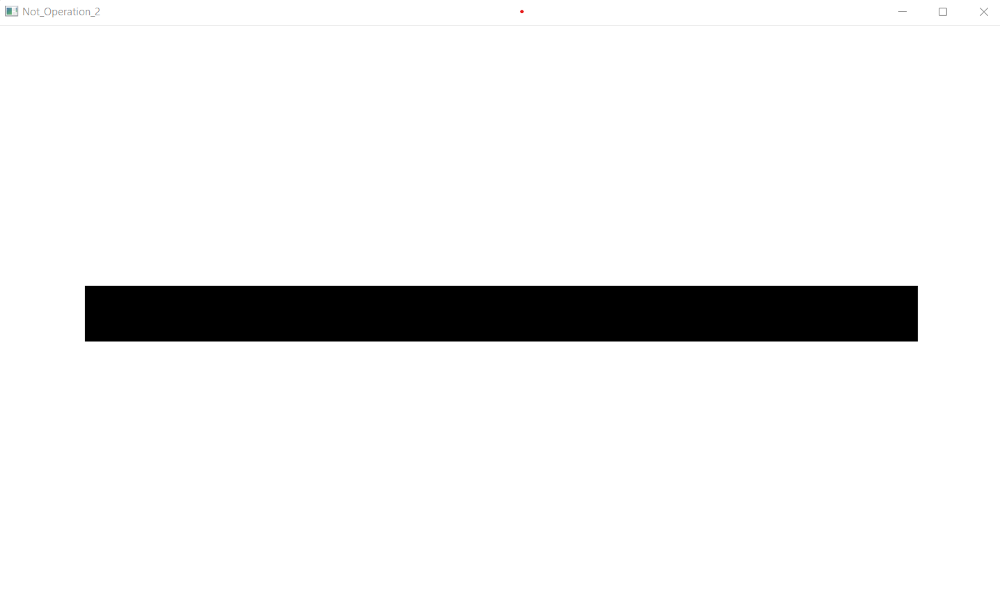

Task--> Create two images one with a white Shape at center and another with a Another white Shape at center and performe all logical gate operations on both images and display the output images.  

**Input Image :**

 

**Shape 1 :**

 

**Shape 2 :**

 

**And Operation :**

 

**OR Operation :**

 

**Not Operation 1 :**

 

**Not Operation 2 :**

 
